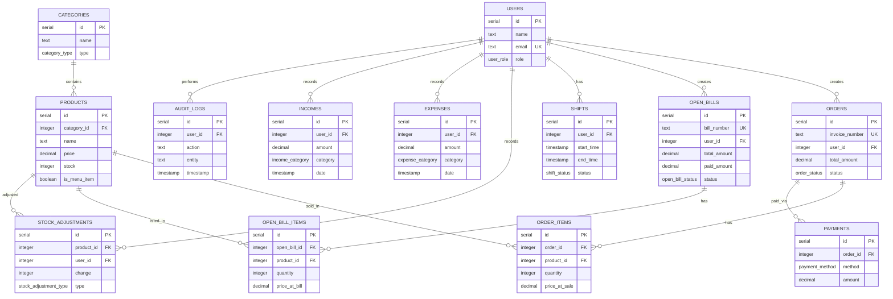
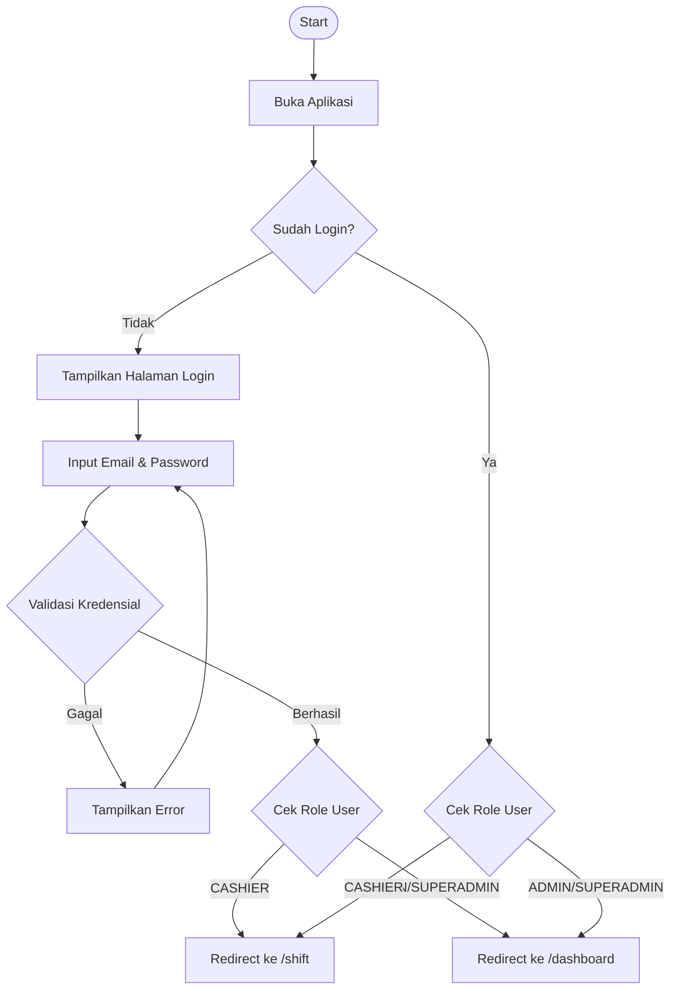
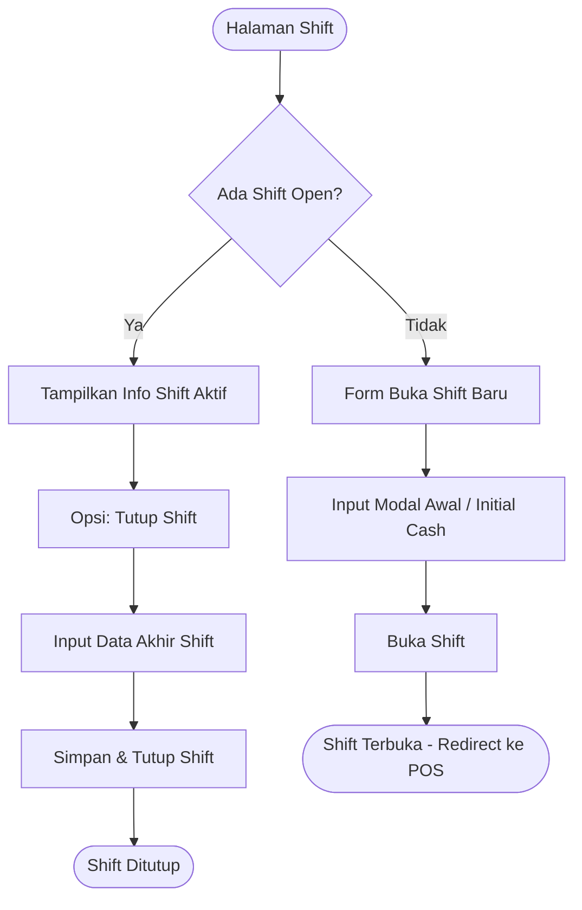
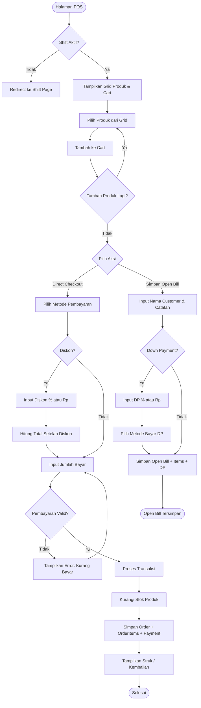
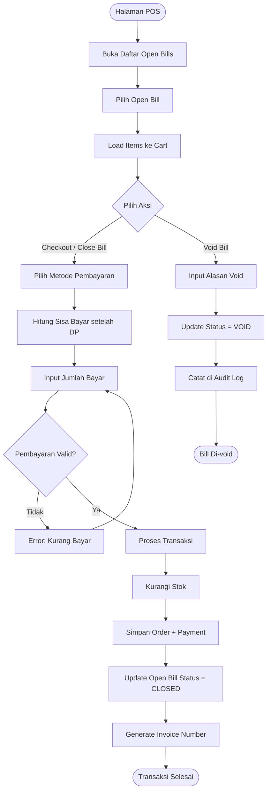
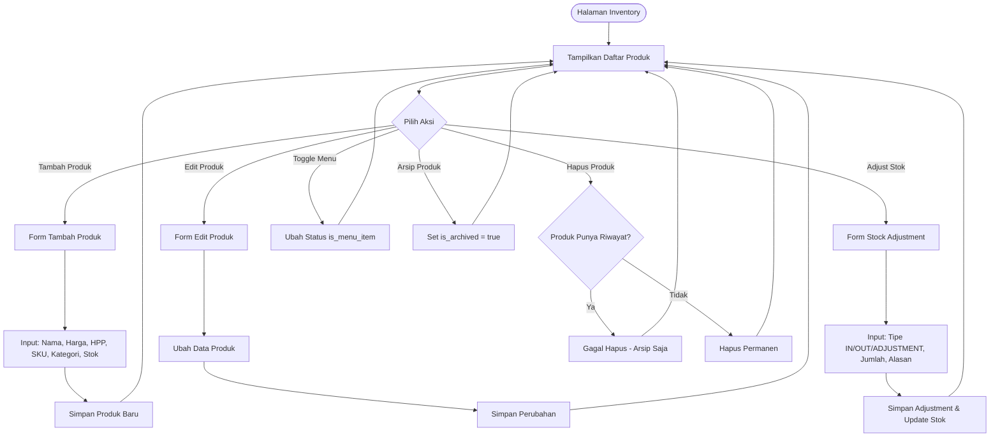
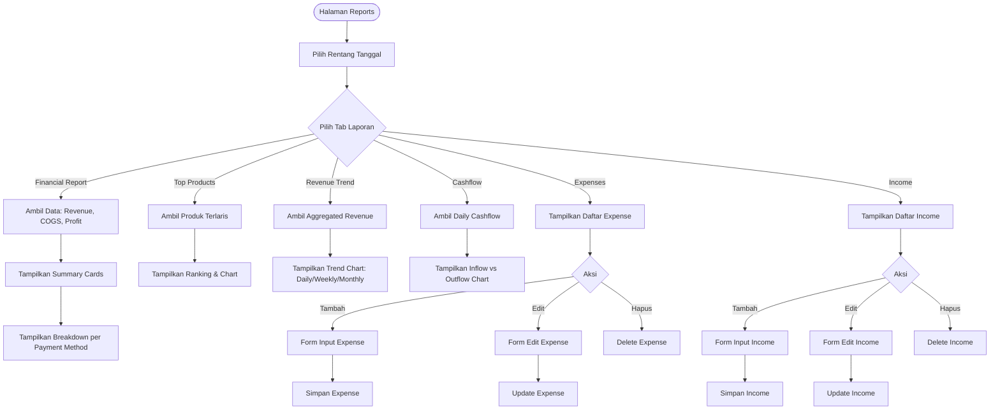
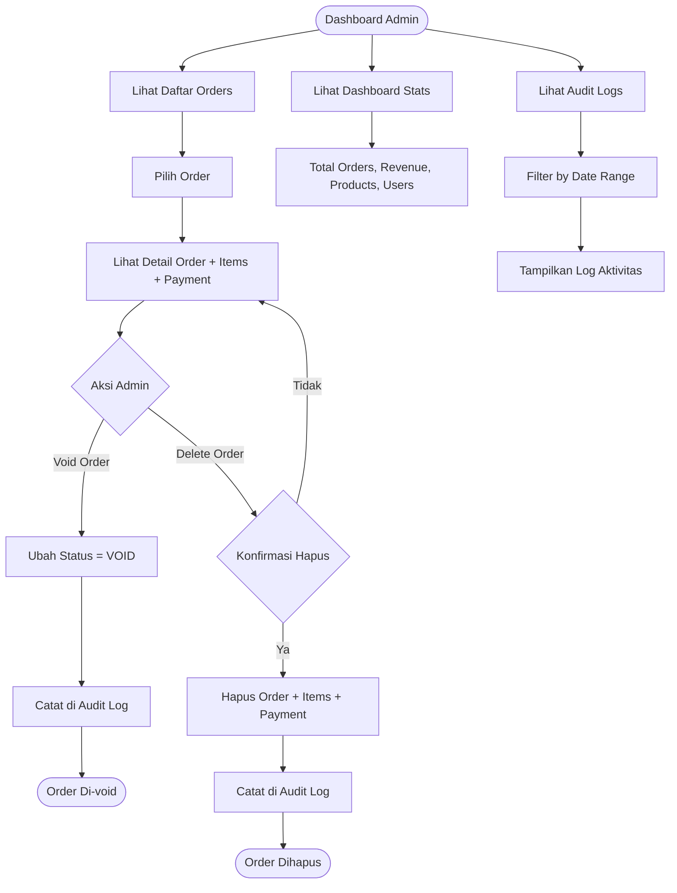
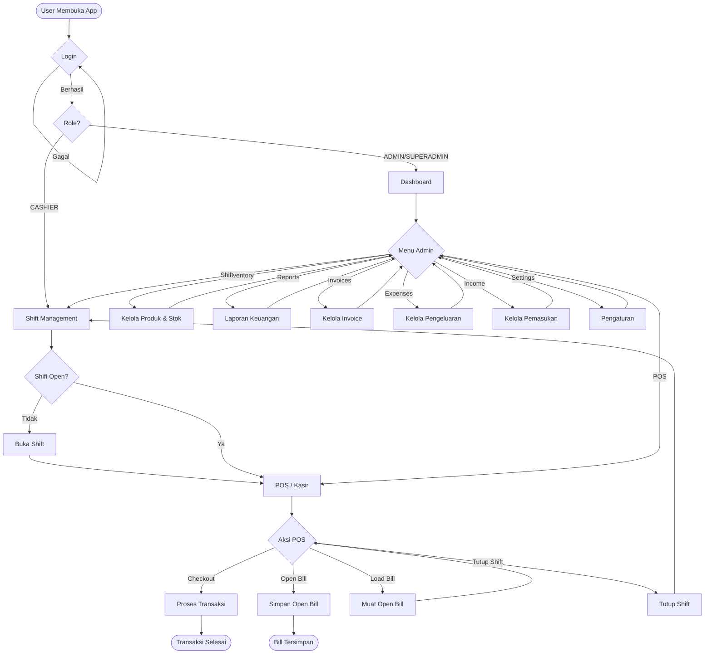

# 📊 Diagram UML - POS Kygoo V2

---

## 1. Use Case Diagram

```mermaid
flowchart LR
    Cashier(("🧍 Cashier"))
    Admin(("🧍 Admin"))
    SuperAdmin(("🧍 SuperAdmin"))

    subgraph System["<<system>> POS Kygoo V2"]
        direction TB

        subgraph Row1["Operasional Harian"]
            direction LR

            subgraph Auth["Autentikasi"]
                direction LR
                UC1(["Login"])
                UC2(["Logout"])
            end

            subgraph Shift["Shift"]
                direction LR
                UC3(["Buka Shift"])
                UC4(["Tutup Shift"])
            end

            subgraph Pos["POS & Open Bill"]
                direction LR
                UC5(["Lihat Menu POS"])
                UC6(["Tambah Item ke Cart"])
                UC7(["Proses Checkout"])
                UC8(["Buat Open Bill"])
                UC9(["Lihat Open Bills"])
                UC10(["Tutup Open Bill & Checkout"])
                UC11(["Void Open Bill"])
            end
        end

        subgraph Row2["Manajemen"]
            direction LR

            subgraph Inventory["Inventori"]
                direction LR
                UC12(["Lihat Inventori"])
                UC13(["Tambah Produk"])
                UC14(["Edit Produk"])
                UC15(["Arsip / Hapus Produk"])
                UC16(["Adjust Stok"])
                UC17(["Toggle Menu Item"])
            end

            subgraph Reporting["Dashboard & Laporan"]
                direction LR
                UC18(["Lihat Dashboard Stats"])
                UC19(["Lihat Laporan Keuangan"])
                UC20(["Lihat Top Products"])
                UC21(["Lihat Revenue Aggregated"])
                UC22(["Lihat Daily Cashflow"])
                UC28(["Lihat Invoices"])
                UC29(["Lihat Detail Invoice"])
            end

            subgraph Finance["Keuangan"]
                direction LR
                UC23(["Kelola Expense"])
                UC24(["Kelola Income"])
            end

            subgraph Control["Kontrol Admin"]
                direction LR
                UC25(["Lihat Audit Log"])
                UC26(["Void Order"])
                UC27(["Delete Order"])
            end
        end
    end

    Cashier --- UC1
    Cashier --- UC2
    Cashier --- UC3
    Cashier --- UC4
    Cashier --- UC5
    Cashier --- UC6
    Cashier --- UC7
    Cashier --- UC8
    Cashier --- UC9
    Cashier --- UC10
    Cashier --- UC11

    Admin --- UC12
    Admin --- UC13
    Admin --- UC14
    Admin --- UC15
    Admin --- UC16
    Admin --- UC17
    Admin --- UC18
    Admin --- UC19
    Admin --- UC20
    Admin --- UC21
    Admin --- UC22
    Admin --- UC23
    Admin --- UC24
    Admin --- UC25
    Admin --- UC26
    Admin --- UC27
    Admin --- UC28
    Admin --- UC29

    SuperAdmin -. "extends" .-> Admin
    Admin -. "extends" .-> Cashier

    classDef actor fill:#ffffff,stroke:#333,stroke-width:1.5px,color:#111;
    classDef usecase fill:#fdfdfd,stroke:#333,stroke-width:1px,color:#111;
    class Cashier,Admin,SuperAdmin actor;
    class UC1,UC2,UC3,UC4,UC5,UC6,UC7,UC8,UC9,UC10,UC11,UC12,UC13,UC14,UC15,UC16,UC17,UC18,UC19,UC20,UC21,UC22,UC23,UC24,UC25,UC26,UC27,UC28,UC29 usecase;
```

---

## 2. Entity Relationship Diagram (ERD)

---

## 3. Flowchart - Alur Utama Aplikasi

### 3a. Flowchart Login & Routing

### 3b. Flowchart Shift Management

### 3c. Flowchart Transaksi POS (Direct Checkout)

### 3d. Flowchart Open Bill → Checkout

### 3e. Flowchart Inventory Management

### 3f. Flowchart Laporan & Keuangan

### 3g. Flowchart Admin - Order Management

---

## 4. Flowchart Keseluruhan Sistem (High-Level)

